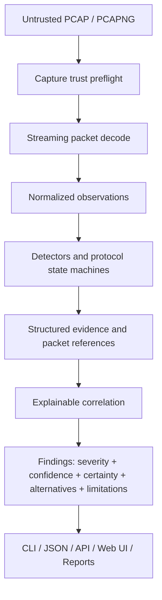

# TraceSleuth

**Packets tell the story. TraceSleuth finds the problem.**

TraceSleuth is an open-source PCAP analysis platform that automatically detects network faults, anomalies, protocol issues, loops, redundancy failures, and other network pathologies.

> **Primary product promise:** Upload or analyze a packet capture and receive evidence-backed findings showing what appears wrong, why TraceSleuth reached that conclusion, which packets support it, how confident the diagnosis is, what alternative explanations exist, and how to validate the result independently.

## Project status

**Current maturity: early pre-1.0 transformation (`0.1.0` bootstrap).**

TraceSleuth originated from the MIT-licensed SD-WAN Triage project and is being transformed into an independent, deterministic-first network fault-analysis platform. The imported application already provides substantial PCAP analysis, protocol parsing, CLI, web UI, reporting, packet inspection, and two-capture comparison capabilities. The defining TraceSleuth architecture—capture trust, normalized observations, structured evidence, stable detector contracts, advanced L2 analysis, LACP, MLAG symptom inference, and generalized multi-capture correlation—is being implemented incrementally.

Do not interpret the current repository as a stable 1.0 product. In particular:

- no production-stable TraceSleuth loop detector is claimed yet;
- no full LACP state-machine detector is claimed yet;
- no universal MLAG parser is claimed or planned;
- MLAG-related conclusions will be symptom inference with explicit evidence and limitations;
- current inherited findings do not yet all use the target normalized evidence model;
- inherited authentication and upload-security issues identified in the baseline audit require remediation before production server exposure.

See [`docs/audits/INITIAL_BASELINE_AUDIT.md`](docs/audits/INITIAL_BASELINE_AUDIT.md) for the exact starting state.

---

## What TraceSleuth is becoming

TraceSleuth is designed for deterministic, evidence-backed diagnosis across:

- campus and enterprise LANs;
- data-center networks;
- WAN and SD-WAN environments;
- traditional routed networks;
- Internet-edge environments;
- server networks;
- highly redundant LACP/MLAG architectures;
- voice networks;
- multi-vendor environments.

The target diagnostic scope includes:

### Capture trust

- PCAP/PCAPNG integrity;
- link-layer visibility;
- truncation;
- timestamp quality;
- parser failures;
- capture loss where metadata exposes it;
- duplicate capture / probable SPAN duplication;
- visibility limitations that reduce confidence in other findings.

### Layer 2

- exact and near-duplicate frame storms;
- broadcast and multicast storms;
- probable Layer-2 loops;
- unknown-unicast flooding symptoms where observable;
- ARP and IPv6 Neighbor Discovery anomalies;
- STP/RSTP/MSTP/PVST-related instability where observable.

### Link aggregation and redundancy

- LACP actor/partner state;
- key and identity inconsistency;
- synchronization, collecting, and distributing loss;
- partner churn and timeout mismatch;
- VRRP and HSRP instability;
- probable duplicate forwarding;
- multi-chassis forwarding inconsistency;
- MLAG split-brain-compatible symptoms without pretending that MLAG is one standardized wire protocol.

### Layer 3, transport, and services

- routing-loop symptoms;
- TTL/hop-limit anomalies;
- ICMP errors;
- fragmentation and MTU/PMTUD symptoms;
- TCP handshake failures, retransmissions, duplicate ACKs, reordering, zero windows, RTT and resets;
- DNS failures and latency;
- DHCP allocation failures and competing-server behavior;
- NTP anomalies;
- SIP/RTP quality issues;
- tunnel and encapsulation anomalies.

### Multi-capture correlation

The target model supports arbitrary named capture points rather than assuming only “LAN” and “WAN”:

```text
Capture A — client access
Capture B — server access
Capture C — firewall ingress
Capture D — firewall egress
Capture E — WAN edge
```

TraceSleuth will correlate disappearance, duplication, modification, NAT, TTL/DSCP changes, encapsulation, ordering, asymmetry, duplicate forwarding, and latency while making timing uncertainty explicit.

---

## Engineering principles

### Deterministic analysis first

An LLM or other generative AI system must never be the primary authority deciding whether a loop, LACP fault, STP problem, retransmission anomaly, MLAG inconsistency, or other network pathology exists.

Primary findings come from protocol parsing, state machines, time-series analysis, packet correlation, frame fingerprinting, statistical analysis, standards-based validation, deterministic rules, and documented heuristics.

Optional AI functionality may later explain deterministic findings or summarize them. Core analysis works without cloud services, AI models, external APIs, or Internet access.

### Evidence before conclusion

A significant TraceSleuth finding is expected to answer:

1. What was observed?
2. Which packets support the observation?
3. During what time range did it occur?
4. Which entities were involved?
5. Why does the evidence indicate a problem?
6. How confident is TraceSleuth?
7. Is the condition observed or inferred?
8. Which alternative explanations exist?
9. Which capture limitations may invalidate the conclusion?
10. How can an engineer validate the result independently in Wireshark?
11. What should be investigated next?

### Fact, inference, and hypothesis are different

Target certainty values are:

```text
observed
strongly_inferred
probable
possible
informational
```

For example, if a capture shows duplicate forwarding, LACP identity changes, and correlated path anomalies, TraceSleuth may report that the evidence is consistent with a multi-chassis forwarding inconsistency. It must not assert that a specific MLAG peer link is down unless that state is directly observable.

### False-positive resistance over dramatic claims

Duplicate frames can be caused by loops, but also by SPAN configuration, packet brokers, TAP aggregation, capturing both sides of a link, port-channel member mirroring, ERSPAN, legitimate retransmission, intentional replication, or capture artifacts.

High-severity conclusions should normally require multiple independent signals unless one protocol violation is itself definitive.

---

## Current inherited capabilities

The imported baseline already contains useful functionality that will be preserved where correct:

- offline PCAP and PCAPNG processing;
- Go-based backend;
- CLI analysis;
- embedded React web interface;
- JSON output;
- HTML/CSV/PDF-oriented report paths;
- packet inspection and packet export;
- timeline data;
- two-capture LAN/WAN comparison;
- packet modification/NAT/TTL/DSCP comparison concepts;
- TCP handshake and RTT analysis;
- DNS, ARP, ICMP, DHCP, NTP, SIP/RTP, tunnel, BGP, VRRP, HSRP, CDP, LLDP, and basic STP-related analysis;
- selected security-oriented analyzers;
- local storage and embedded authentication;
- single-binary distribution intent.

These capabilities are not automatically considered TraceSleuth-stable. Each detector must meet the project acceptance criteria before it is advertised as stable.

---

## Architecture direction



The existing application will evolve incrementally toward a cleaner package model covering capture ingestion, capture quality, normalized protocol observations, detectors, evidence, findings, correlation, topology, reporting, API, authentication, storage, and configuration.

Massive uncontrolled rewrites are explicitly avoided.

---

## Example target finding

The following illustrates the intended output style. It is a product-format example, not a claim that the current `0.1.0` code already implements this detector.

```text
CRITICAL — Probable Layer-2 forwarding loop

Confidence: 96/100
Certainty: strongly_inferred

Observed:
- 287,431 repeated Ethernet frames in 8.3 seconds.
- Broadcast rate increased from 42 pps to 31,872 pps.
- One ARP request fingerprint was observed 4,721 times.
- Median recurrence interval was 630 microseconds.
- An STP topology-change event occurred 112 ms before amplification began.

Alternative explanations considered:
- Multiple-source SPAN duplication
- Packet broker replication
- Port-channel member mirroring

Why they are less likely:
- Frame multiplicity increased over time instead of remaining at a fixed factor.
- Multiple independent broadcast fingerprints amplified together.
- STP instability preceded amplification.

Recommended validation:
- Review the referenced packet range.
- Apply the provided Wireshark display filters.
- Inspect root-bridge and blocked-port changes on affected switches.
```

Real findings must reference actual packets and must not fabricate evidence.

---

## Quick start during the 0.1.0 bootstrap

The imported executable path has not yet been renamed in code. Until the build-safe executable/module migration lands, use the legacy entry point explicitly:

```bash
git clone https://github.com/DanielDietz-de/TraceSleuth.git
cd TraceSleuth

go run ./cmd/sdwan-triage -help
```

Analyze one capture:

```bash
go run ./cmd/sdwan-triage capture.pcap
```

Start the current loopback-only web UI:

```bash
go run ./cmd/sdwan-triage -web
```

The intended TraceSleuth CLI evolves toward:

```text
tracesleuth analyze capture.pcap
tracesleuth compare capture-a.pcap capture-b.pcap
tracesleuth serve
tracesleuth detectors list
tracesleuth version
```

Those commands must not be treated as implemented until the corresponding code and tests exist.

---

## Supported capture formats

The imported capture reader currently recognizes:

- classic PCAP;
- classic PCAP nanosecond variants;
- PCAPNG section-header format.

PCAPNG mixed-link-type reading is enabled. A full capture-quality preflight, interface metadata model, truncation analysis, timestamp-quality analysis, and duplicate-capture detector are planned before advanced fault inference is trusted.

---

## Supported platforms

The imported release workflow currently builds for:

| Platform | Architecture |
|---|---|
| Linux | amd64 |
| macOS | amd64 |
| macOS | arm64 |
| Windows | amd64 |

Platform support will be revalidated under the TraceSleuth release process. A build target is not automatically a guarantee of production support.

---

## Detector maturity

TraceSleuth uses the following intended detector status vocabulary:

- `experimental`
- `beta`
- `stable`

No detector should be called stable until it has a stable ID, documented algorithm, positive fixture, negative fixture, false-positive fixture where relevant, unit and boundary tests, confidence and limitation documentation, Wireshark validation guidance, JSON/UI presentation, packet evidence references, and changelog coverage.

High-risk heuristic detectors such as probable loops and MLAG symptoms require multiple adversarial false-positive fixtures.

---

## Security and privacy

Packet captures are highly sensitive. They may contain credentials, tokens, cookies, personal data, internal addresses, DNS names, file contents, and application payloads.

TraceSleuth is intended to remain local-first:

- no mandatory cloud dependency;
- no mandatory AI service;
- no automatic PCAP upload to external services;
- no default telemetry.

The imported baseline currently contains security issues that are explicitly documented in the baseline audit, including universal default administrator credentials and upload-handling weaknesses. Do not expose the current pre-stable web application on untrusted networks until those issues are resolved and the deployment path is documented as hardened.

---

## Versioning

TraceSleuth starts a new semantic-version lineage:

```text
0.1.0
```

It does not continue the SD-WAN Triage 6.x sequence.

The repository-root [`VERSION`](VERSION) file is the authoritative product version source. See [`docs/project/VERSIONING.md`](docs/project/VERSIONING.md).

---

## Roadmap

The high-level progression is:

```text
0.1.0  Product bootstrap, provenance, identity, repository hardening
0.2.0  Capture integrity and normalized evidence foundation
0.3.0  Detector framework and correlation engine
0.4.0  Layer-2 pathology engine
0.5.0  STP, LACP, redundancy and MLAG symptom analysis
0.6.0  Multi-capture correlation and topology reasoning
0.7.0  Diagnostic UI and evidence workflows
0.8.0  Production hardening, security and deployment
0.9.0  Release candidate and detector validation
1.0.0  First stable public TraceSleuth release
```

See [`ROADMAP.md`](ROADMAP.md) for phased acceptance criteria.

---

## Documentation

Current bootstrap documentation:

- [`docs/audits/INITIAL_BASELINE_AUDIT.md`](docs/audits/INITIAL_BASELINE_AUDIT.md) — actual imported architecture, detectors, security, tests, CI, storage, and debt.
- [`UPSTREAM.md`](UPSTREAM.md) — exact upstream baseline and relationship.
- [`docs/history/ORIGIN.md`](docs/history/ORIGIN.md) — architectural and functional evolution.
- [`docs/development/UPSTREAM_WORKFLOW.md`](docs/development/UPSTREAM_WORKFLOW.md) — deliberate upstream-review process.
- [`docs/project/VERSIONING.md`](docs/project/VERSIONING.md) — independent version policy.
- [`docs/project/RELEASE_PROCESS.md`](docs/project/RELEASE_PROCESS.md) — release gates and artifacts.
- [`ROADMAP.md`](ROADMAP.md) — implementation phases and acceptance criteria.

Additional architecture, detector, testing, security, operations, usage, and deployment documentation will be added with the implementation that makes it true.

---

## Contributing

Contributions are welcome, especially in:

- capture-quality analysis;
- packet evidence and PCAP fixture generation;
- deterministic protocol parsing;
- false-positive test cases;
- STP/LACP/ARP/ND/FHRP diagnostics;
- multi-capture correlation;
- parser fuzzing;
- performance benchmarking;
- secure self-hosting;
- documentation and Wireshark validation workflows.

Do not submit private customer or production captures to the public repository. Prefer minimal synthetic fixtures and document provenance and redistribution rights for third-party captures.

---

## Upstream attribution

TraceSleuth originated from the MIT-licensed **SD-WAN Triage** project by Gocisse.

TraceSleuth preserves attribution to the original project while pursuing an independent architecture, roadmap, product identity, release lifecycle, and network-diagnostics mission.

TraceSleuth is not represented as an official continuation of SD-WAN Triage, an endorsed build, or a replacement maintained by the original SD-WAN Triage author.

Exact provenance:

```text
Original project:  SD-WAN Triage
Original repository: https://github.com/gocisse/sdwan-triage
Upstream baseline: 43c6cd412860a5219577be6d30feca2db7f57309
TraceSleuth import: da35429b7284bb6a2bc61f2049209dfff299703c
```

See [`UPSTREAM.md`](UPSTREAM.md) and [`docs/history/ORIGIN.md`](docs/history/ORIGIN.md).

---

## License

TraceSleuth is distributed under the MIT License inherited from the upstream project. The original copyright and permission notice are preserved in [`LICENSE`](LICENSE).

Additional TraceSleuth contributions do not erase upstream rights or provenance.

---

**Packets tell the story. TraceSleuth finds the problem.**
