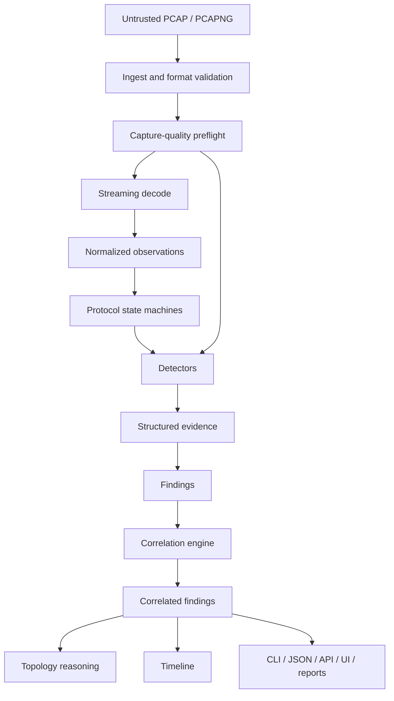

# TraceSleuth architecture

## Status

This document describes the intended architecture and the migration boundaries from the imported SD-WAN Triage codebase. It is a target architecture, not a claim that every package shown below already exists.

The actual imported state is documented in `docs/audits/INITIAL_BASELINE_AUDIT.md`.

## Architectural goals

TraceSleuth must be:

- deterministic-first;
- evidence-backed;
- local-first and offline-capable;
- secure against untrusted capture input;
- bounded in memory and concurrency where practical;
- explicit about capture limitations;
- modular across generic protocols, detectors, vendor enrichment, and correlation;
- suitable for CLI, API, web UI, and report consumers;
- incrementally evolvable from the existing Go codebase.

## Core principles

### 1. Capture trust precedes diagnosis

A detector cannot make a high-confidence L2, TCP, STP, LACP, or redundancy conclusion without knowing whether the capture is truncated, duplicated, missing L2 headers, timestamp-corrupted, malformed, or otherwise limited.

### 2. Observations are not findings

A protocol parser should produce facts such as:

```text
LACP partner system ID changed at packet 812
```

A detector may interpret a sequence of such observations as:

```text
LACP partner instability
```

A correlation rule may combine several findings as:

```text
Probable multi-chassis forwarding inconsistency
```

These layers must remain distinguishable.

### 3. Evidence is first-class

Every significant finding should be traceable to real capture packets, time ranges, protocol fields, metrics, thresholds, and limitations.

### 4. Generic protocol logic and vendor enrichment are separate

LACP, STP, LLDP, ARP, TCP, and other generic protocol implementations must not be contaminated with assumptions about a specific vendor's MLAG technology.

### 5. No uncontrolled rewrite

The imported code already provides valuable functionality. Migration should introduce adapters and compatibility paths, then retire obsolete models only after equivalent behavior is tested.

## Current imported architecture

The imported application currently centers on:

```text
cmd/sdwan-triage
      |
      v
pkg/analyzer.Processor
      |
      +--> DetectorRegistry
      |      +--> independent analyzers
      |      +--> stateful analyzers
      |
      +--> finalizeReport
      |
      v
models.TriageReport
      |
      +--> CLI output
      +--> JSON
      +--> HTML / CSV / PDF paths
      +--> web API result files
```

The web path adds Gin, SQLite authentication, local storage, miniredis-based job metadata, WebSockets, packet inspection/export, metrics, integrations, and an embedded React frontend.

## Target logical pipeline



Capture-quality results flow into detectors and correlation so confidence can be reduced or conclusions suppressed when capture visibility is inadequate.

## Target package boundaries

The eventual structure is expected to resemble:

```text
/
├── cmd/
│   └── tracesleuth/
├── internal/
│   ├── analysis/
│   │   ├── engine/
│   │   ├── pipeline/
│   │   ├── correlation/
│   │   ├── scoring/
│   │   └── timeline/
│   ├── capture/
│   │   ├── ingest/
│   │   ├── metadata/
│   │   ├── quality/
│   │   ├── fingerprint/
│   │   └── export/
│   ├── protocols/
│   │   ├── ethernet/
│   │   ├── vlan/
│   │   ├── stp/
│   │   ├── lacp/
│   │   ├── lldp/
│   │   ├── cdp/
│   │   ├── arp/
│   │   ├── nd/
│   │   ├── fhrp/
│   │   ├── ipv4/
│   │   ├── ipv6/
│   │   ├── tcp/
│   │   ├── udp/
│   │   ├── icmp/
│   │   ├── dns/
│   │   ├── dhcp/
│   │   ├── routing/
│   │   ├── voice/
│   │   └── tunnels/
│   ├── detectors/
│   │   ├── capturequality/
│   │   ├── l2/
│   │   ├── redundancy/
│   │   ├── transport/
│   │   ├── routing/
│   │   ├── services/
│   │   └── voice/
│   ├── evidence/
│   ├── findings/
│   ├── topology/
│   ├── reporting/
│   ├── storage/
│   ├── api/
│   ├── auth/
│   └── config/
├── web/frontend/
├── api/openapi/
├── docs/
├── testdata/
│   ├── pcaps/
│   ├── golden/
│   └── malformed/
├── tools/pcapgen/
├── deploy/
│   ├── docker/
│   ├── systemd/
│   └── examples/
└── .github/workflows/
```

This structure is a migration target. Existing well-structured code should be adapted rather than moved gratuitously.

## Capture domain

The capture domain owns:

- file format validation;
- PCAP/PCAPNG reader lifecycle;
- capture identity/hash;
- metadata;
- PCAPNG interface metadata;
- truncation and malformed counters;
- timestamp characteristics;
- link-layer visibility;
- duplicate capture detection;
- capture gaps;
- safe evidence export.

It must not decide that a network pathology exists merely because the capture is unusual.

## Observation model

Representative observations include:

```text
EthernetFrameObservation
VLANObservation
ARPObservation
NDObservation
STPObservation
LACPObservation
LLDPObservation
CDPObservation
FHRPObservation
TCPObservation
DNSObservation
DHCPObservation
ICMPObservation
RoutingObservation
TunnelObservation
CaptureInterfaceObservation
```

Observations retain source context sufficient for evidence traceability, including capture ID, packet number, timestamp, interface ID, capture point, link type, relevant addresses, VLANs, flow ID, protocol fields, and fingerprints.

Full payloads should not be duplicated into every observation.

## Detector domain

Detectors consume normalized observations and capture capabilities.

A detector's metadata should include:

```text
ID
Name
Version
Category
Description
RequiredObservations
RequiredCaptureCapabilities
StateRequirements
DefaultThresholds
StandardsReferences
```

A detector lifecycle should support concepts equivalent to:

```text
Initialize(context)
Observe(event)
Finalize()
Findings()
Reset()
```

The exact Go interfaces will be designed against the actual implementation and benchmarked before adoption.

## Evidence and finding domain

A finding represents a diagnostic conclusion. Evidence represents the facts that support it.

The model must distinguish:

- raw observation;
- supporting evidence;
- finding;
- correlated finding;
- alternative explanation;
- capture limitation.

A major finding should carry packet references, metrics, thresholds, confidence, certainty, and validation guidance.

See `FINDING_AND_EVIDENCE_MODEL.md`.

## Correlation domain

Correlation combines independently generated findings and observations through explicit rules.

It must not simply add arbitrary confidence values. Each contribution and penalty must be explainable.

Examples:

```text
STP root change
+ topology-change storm
+ broadcast multiplication
+ repeated ARP fingerprints
+ duplicate-frame amplification
= probable Layer-2 loop
```

and:

```text
LACP partner identity changed
+ synchronization lost
+ duplicate unicast forwarding
+ FHRP multiple-active event
= probable multi-chassis redundancy inconsistency
```

See `CORRELATION_ENGINE.md`.

## Vendor enrichment

Vendor enrichments consume generic observations and may add context using:

- MAC OUI;
- LLDP organizationally specific TLVs;
- CDP information;
- LACP identity patterns;
- vendor protocol extensions;
- explicit user-supplied capture metadata.

They must not change the generic parser's interpretation of standards-based fields.

A vendor plugin may strengthen or weaken a hypothesis only when its evidence is explicit and documented.

## Multi-capture model

The imported comparator assumes two roles: LAN and WAN. The target model treats each capture as a named capture point with metadata:

```text
name
location
device
interface
direction
clock source
known offset
```

Correlation must explicitly account for:

- packet matching uncertainty;
- capture loss;
- duplicated observation;
- clock offset;
- clock drift;
- unsynchronized clocks;
- asymmetric visibility.

Microsecond precision must never be displayed when clock uncertainty makes it indefensible.

## Topology model

Topology edges are classified as:

- direct adjacency;
- inferred relationship;
- communication relationship.

Possible evidence includes LLDP, CDP, STP bridge IDs, LACP actor/partner IDs, ARP, ND, FHRP, capture interfaces, and user-supplied metadata.

Ordinary IP communication must not be drawn as a physical link.

Every inferred edge should carry confidence and evidence references.

## Storage architecture

The current default storage is under `~/.sdwan-triage`. The target storage model will define:

- data directory;
- upload directory;
- temporary directory;
- result/report storage;
- analysis history;
- original-capture retention;
- cleanup policy;
- maximum storage;
- user deletion;
- restrictive permissions;
- privacy implications.

Original packet captures must not be silently retained forever.

## API architecture

The target API base is:

```text
/api/v1/
```

Expected resource families include:

```text
health
version
captures
analyses
findings
detectors
reports
comparisons
```

An OpenAPI specification should be generated from or validated against actual behavior. CI should detect drift where practical.

## Security boundaries

Security-sensitive trust boundaries include:

1. uploaded capture and key-log files;
2. binary packet parsers;
3. filenames and filesystem paths;
4. authentication bootstrap;
5. session/token transport;
6. browser origin/CORS checks;
7. reverse-proxy trust;
8. analysis CPU/memory/disk limits;
9. report rendering of packet-derived strings;
10. optional external integrations.

The capture parser must treat every byte as untrusted.

## Concurrency architecture

The current registry launches one goroutine per independent analyzer for each packet while holding a shared report lock around each call. The target must be benchmark-driven and bounded.

Requirements include:

- no unsafe shared detector state;
- deterministic output where ordering should not matter;
- cancellation support;
- context propagation;
- bounded concurrent analyses;
- no goroutine leaks;
- race testing;
- explicit shutdown.

## Migration strategy

### Stage A — compatibility foundation

- add `VERSION` and version package;
- add capture metadata/quality model alongside existing report;
- add stable finding/evidence model without immediately deleting legacy fields;
- introduce detector metadata adapters.

### Stage B — new detectors use new architecture

Capture quality, capture duplication, frame fingerprints, storms, loop inference, LACP, and MLAG symptoms should be implemented only on the normalized observation/evidence model.

### Stage C — migrate inherited detectors

Move valuable inherited detectors gradually behind the same model, adding fixtures and limitations.

### Stage D — remove compatibility fields

Only after UI/API/report consumers have migrated and schema compatibility is managed.

## Architecture decisions

Durable decisions must be recorded as numbered ADRs under:

```text
docs/architecture/adr/
```

Initial ADRs should cover at least:

- authoritative version source;
- observation/finding separation;
- capture trust before diagnosis;
- detector IDs and versions;
- confidence/certainty model;
- compatibility migration from `TriageReport`;
- multi-capture clock uncertainty;
- secure administrator bootstrap.

## Non-goals

TraceSleuth is not intended to become a generic SIEM, Wireshark replacement, full NDR, cloud-only service, opaque AI diagnosis engine, vendor-specific switch manager, configuration-management system, or network controller.